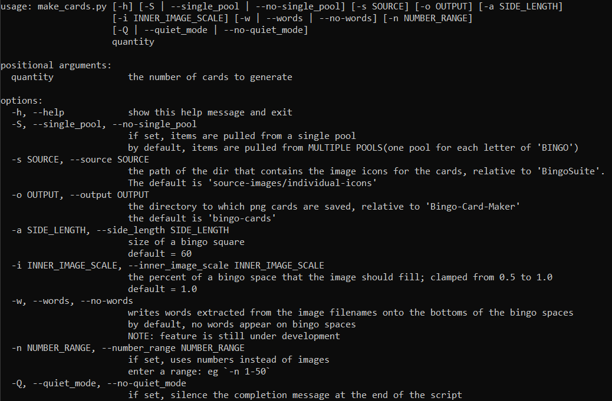
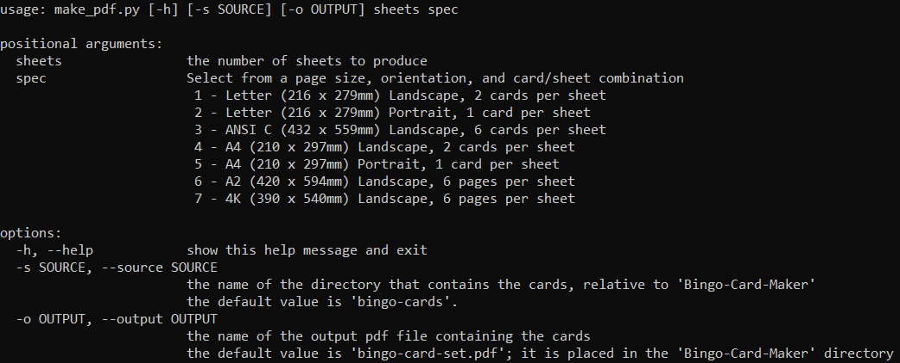
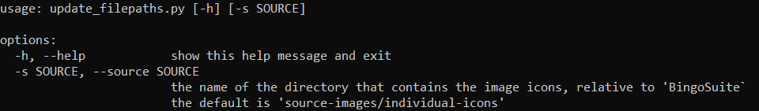
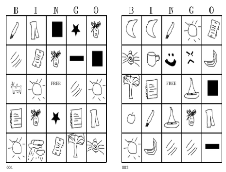
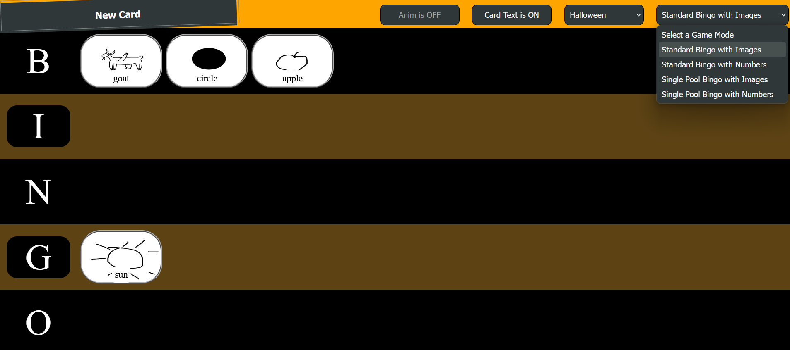

# About Bingo Suite
You can use Bingo Suite to:
* Make Bingo card PDFs.
* Play Bingo with a browser app.

# Usage
Bingo Suite includes three scripts:

1. `make_cards.py` : Make bingo cards, in png format, from either a user-defined number range *OR* from a directory with png files.


2. `make_pdf.py` : Gather the bingo cards made with `make_cards.py` and produce a PDF document.


3. `update_filepaths.py` : Update the image filepaths used in bingo-caller.html.



# Dependencies
This app has been tested with Python 3.12.3.

Best practice is to use Python virtual environments.

After establishing and activating a virtual environment of your choice, you can install the required dependencies via pip.
```
pip install -r requirements.txt
```

# Examples

***NOTE:*** For help with a command, use the `h` flag to bring up a help menu.
```bash
# example
$ python3 bingo_cmd -h
```

## i. Making a Card
```bash
# python3 make_cards.py number_of_cards
# produce a single card
$ python3 make_cards.py 1  
```


## ii. Make a PDF

```bash
# python3 make_pdf.py number_of_sheets form_factor
$ python3 make_pdf.py 1 1
```
The form factor `1` corresponds to the following specification: \
*1 - Letter (216 x 279mm) Landscape, 2 cards per sheet*.

Use `python3 make_pdf.py -h` to learn more about the available form factors.



## iii. Using the Card Caller

Run `update_filepaths.py` to update the filepaths that will be used by the browser app.

Open the browser app at *Bingo_Card-Caller/code/bingo-caller.html*.

